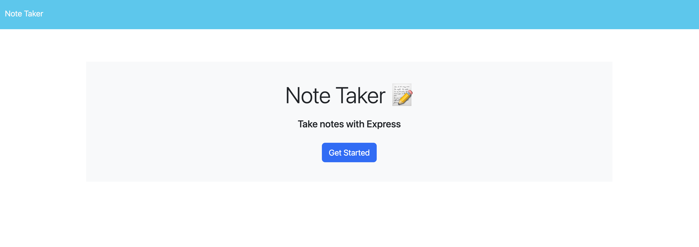

# note-taker

## Description

This project is a note-taking application where the user will click 'Get Started' on the homepage to navigate towards the note-taker. The user is then able to take notes within the browser and add to their collection.

## Table of Contents

- [Installation](#installation)
- [Usage](#usage)
- [Credits](#credits)
- [License](#license)

## Installation

This project requires the installation of Node.js. Here's where you can download these packages:
- Node: https://nodejs.org/en/download
    - you must also run the command 'npm i uuid' after the initial install (npm i)

## Usage

To get the application running, type 'node index' into your terminal and then open the application in your browser from the provided URL. From there, click 'Get Started' to begin taking your notes.

## Credits

Columbia University Coding Bootcamp

## License

MIT License

## How to Contribute

Keep tabs on the [Contributor Covenant](https://www.contributor-covenant.org/)!